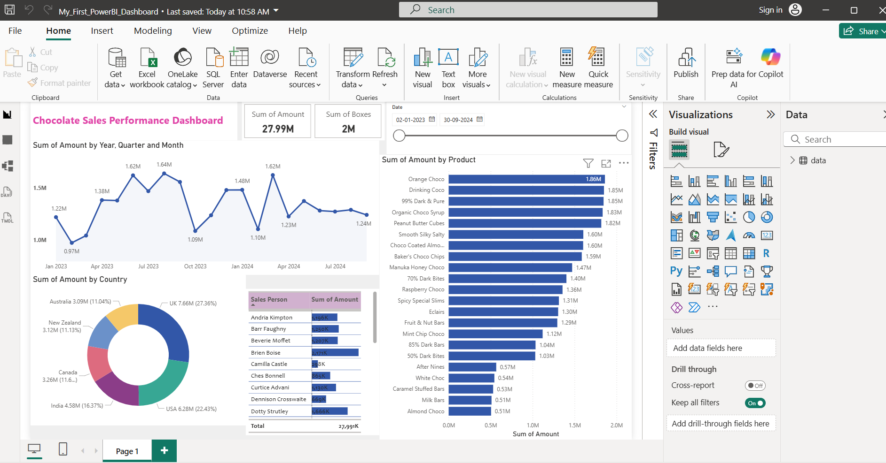

# 🍫 Chocolate Sales Performance Dashboard | Power BI

This repository contains my **first Power BI dashboard project**, created to analyze chocolate sales performance across different **countries, products, and salespersons**.  
The dashboard transforms raw sales data into meaningful business insights using interactive visualizations.

## 📌 Project Objective

The objective of this project is to:
- Analyze overall chocolate sales performance
- Track monthly sales trends
- Identify top-performing products and countries
- Understand salesperson contribution to total sales
- Practice real-world Power BI reporting and dashboard design

## 📄 Data Source

- Sample chocolate sales dataset (CSV/Excel format)  
- Dataset includes sales date, country, product, salesperson, boxes sold, and sales amount
- 
## 📊 Key KPIs

- **Total Sales Amount:** 1.20M  
- **Total Boxes Sold:** 81K  

## 📈 Key Insights

- Sales show noticeable variation across different months
- A small number of products contribute a major share of total revenue
- Certain countries dominate overall sales performance
- Sales contribution varies significantly among salespersons
- 
## 📊 Visualizations Used

- **Line Chart** – Monthly Sales Trend  
- **Donut Chart** – Sales by Country  
- **Bar Chart** – Sales by Product  
- **Table** – Sales by Salesperson  
- **KPI Cards** – Total Sales Amount & Total Boxes Sold  

## 🖼 Dashboard Preview

## 🛠 Tools & Technologies

- Microsoft Power BI  
- Data Cleaning & Data Modeling  
- DAX Measures  
- Data Visualization & Dashboard Design  
## 📂 Repository Contents

- `Chocolate_Sales_Dashboard.pbix` – Power BI report file  
- `dashboard.png` – Dashboard screenshot  
- `README.md` – Project documentation  
## ⭐ Skills Demonstrated

- Business data analysis  
- KPI selection and reporting  
- Dashboard storytelling  
- Power BI fundamentals  
- Basic DAX usage  

## 🚀 Future Enhancements

- Add slicers for Year, Country, and Product
- Include profit and margin analysis
- Implement advanced DAX measures
- Create drill-through pages for deeper analysis

## 👤 Author

**Nithin**  
_B.Tech (IT) Student | Aspiring Data Analyst_  
_First Power BI Portfolio Project_
